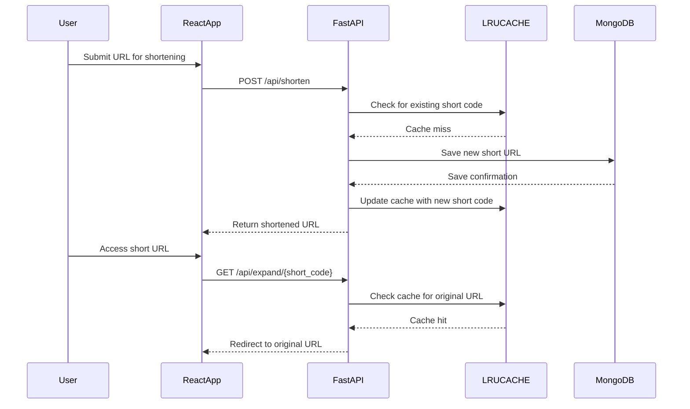

# Distributed URL Shortener System

A production-ready URL shortening service demonstrating distributed systems concepts, caching strategies, and scalable architecture.

## 🏗️ System Architecture

```
┌─────────────┐      ┌──────────────┐      ┌─────────────┐
│   Browser   │─────▶│  React App   │─────▶│  FastAPI    │
└─────────────┘      └──────────────┘      └─────────────┘
                                                   │
                                                   ▼
                                            ┌─────────────┐
                                            │  LRU Cache  │
                                            └─────────────┘
                                                   │
                                                   ▼
                                            ┌─────────────┐
                                            │  MongoDB    │
                                            └─────────────┘
```


### Core Features

1. **Distributed Caching Strategy**
   - LRU (Least Recently Used) in-memory cache with O(1) operations
   - Write-through and read-through caching patterns
   - Cache warming on URL creation
   - Real-time cache hit rate monitoring

2. **Storage Optimization**
   - Base62 encoding for collision-resistant short codes
   - Counter-based collision handling mechanism
   - MongoDB with optimized indexes for fast queries
   - Horizontal scaling ready architecture

3. **Performance & Scalability**
   - Token bucket rate limiting (100 requests/minute)
   - Async/await for non-blocking I/O operations
   - Database query optimization with projections
   - Sub-millisecond response times for cached URLs

4. **Analytics & Monitoring**
   - Real-time click tracking and analytics
   - Aggregation pipelines for system metrics
   - Time-series data for trend analysis
   - System-wide performance monitoring

5. **Production-Ready Features**
   - Custom alias support
   - RESTful API design
   - Error handling and validation
   - CORS configuration
   - Graceful shutdown handling

## Data Flow

The application follows a structured data flow between the user interface, backend, cache, and database. The following sequence diagram illustrates the key interactions in the system:




## 🚀 Tech Stack

- **Backend**: FastAPI (Python) - High-performance async web framework
- **Frontend**: React 19 with shadcn/ui components
- **Database**: MongoDB with Motor (async driver)
- **Caching**: In-memory LRU cache implementation

## 📋 Prerequisites

- Python 3.8+
- Node.js 16+
- MongoDB (local or remote)


## 🛠️ Installation & Setup

### 1. Clone the Repository

```bash
cd /app
```

### 2. Backend Setup

```bash
cd backend

# Install Python dependencies
pip install -r requirements.txt

# Environment variables are already configured in .env
# MONGO_URL="mongodb://localhost:27017"
# DB_NAME="test_database"
```

### 3. Frontend Setup

```bash
cd ../frontend

# Install Node.js dependencies
npm install
npm start

# Environment variables are pre-configured in .env
```

### 4. Access the Application

- **Frontend**: http://localhost:3000 (or your configured URL)
- **Backend API**: http://localhost:8001/api
- **API Documentation**: http://localhost:8001/docs

## 🎯 How to Use

### Basic Usage

1. **Shorten a URL**
   - Navigate to the "Shorten URL" tab
   - Enter a long URL
   - Optionally add a custom alias
   - Click "Shorten URL"
   - Copy and share the generated short link

2. **View URL List**
   - See all shortened URLs
   - View click counts
   - Delete URLs
   - View detailed statistics

3. **Analytics Dashboard**
   - Monitor system metrics
   - View top performing URLs
   - Check cache performance
   - Track recent activity

### API Endpoints

```bash
# Shorten a URL
curl -X POST http://localhost:8001/api/shorten \
  -H "Content-Type: application/json" \
  -d '{"url": "https://example.com/very-long-url"}'

# Redirect to original URL
curl -X GET http://localhost:8001/api/expand/abc123

# Get URL statistics
curl -X GET http://localhost:8001/api/stats/abc123

# List all URLs
curl -X GET http://localhost:8001/api/urls

# Get system metrics
curl -X GET http://localhost:8001/api/metrics

# Delete a URL
curl -X DELETE http://localhost:8001/api/urls/abc123

# Clear cache
curl -X POST http://localhost:8001/api/cache/clear
```

## 🧪 Testing

### Test URL Shortening

```bash
# Test basic shortening
curl -X POST http://localhost:8001/api/shorten \
  -H "Content-Type: application/json" \
  -d '{"url": "https://www.amazon.com"}'

# Test with custom alias
curl -X POST http://localhost:8001/api/shorten \
  -H "Content-Type: application/json" \
  -d '{"url": "https://www.amazon.com", "custom_alias": "amazon-shopping"}'
```

### Test Caching Performance

```bash
# First request (cache miss)
time curl -X GET http://localhost:8001/api/expand/abc123

# Second request (cache hit - should be faster)
time curl -X GET http://localhost:8001/api/expand/abc123

# Check cache statistics
curl -X GET http://localhost:8001/api/metrics
```

### Load Testing 

```bash
# Install apache bench
sudo apt-get install apache2-utils

# Test URL creation
ab -n 1000 -c 10 -p payload.json -T application/json http://localhost:8001/api/shorten

# Test URL expansion (cached)
ab -n 10000 -c 50 http://localhost:8001/api/expand/abc123
```

## 📊 System Design Concepts Demonstrated

### 1. Caching Strategies
- **LRU Cache**: Most recently accessed items stay in cache
- **Cache Invalidation**: Automatic cleanup on URL deletion
- **Write-Through**: Data written to cache and DB simultaneously
- **Read-Through**: Cache checked first, DB on miss

### 2. Distributed Systems
- **Horizontal Scalability**: Stateless API design allows multiple instances
- **Collision Handling**: Counter-based resolution for hash conflicts
- **Consistent Hashing**: Base62 encoding for distributed ID generation

### 3. Performance Optimization
- **Async Operations**: Non-blocking I/O for better throughput
- **Database Indexing**: Compound indexes for fast lookups
- **Query Optimization**: Field projections to reduce data transfer
- **Rate Limiting**: Token bucket algorithm for API protection

### 4. Data Structures & Algorithms
- **OrderedDict**: For O(1) LRU cache operations
- **Base62 Encoding**: Efficient URL-safe ID generation
- **SHA256 Hashing**: Deterministic short code generation
- **Aggregation Pipelines**: For analytics queries


## 📁 Project Structure

```
/app/
├── backend/
│   ├── server.py          # Main FastAPI application
│   ├── requirements.txt   # Python dependencies
│   └── .env              # Backend configuration
├── frontend/
│   ├── src/
│   │   ├── App.js        # Main React component
│   │   ├── App.css       # Styles
│   │   └── components/   # Reusable UI components
│   ├── package.json      # Node dependencies
│   └── .env             # Frontend configuration
└── README.md            # This file
```

## 🔍 Key Algorithms Explained

### Base62 Encoding
```python
# Converts integer to base62 string (0-9, a-z, A-Z)
# Benefits: URL-safe, compact, case-sensitive
BASE62 = "0123456789abcdefghijklmnopqrstuvwxyzABCDEFGHIJKLMNOPQRSTUVWXYZ"
```

### LRU Cache
```python
# OrderedDict provides O(1) access and O(1) eviction
# move_to_end() marks item as recently used
# popitem(last=False) removes least recently used
```

### Token Bucket Rate Limiter
```python
# Allows burst traffic while maintaining average rate
# Tokens refill at constant rate
# Requests consume tokens
```

## 🚦 Monitoring & Observability

The system includes built-in monitoring:

- **Cache Metrics**: Hit rate, size, capacity
- **Performance**: Request latency, throughput
- **Analytics**: Click tracking, top URLs
- **System Health**: Total URLs, recent activity

## 🔐 Security Features

- Rate limiting to prevent abuse
- Input validation and sanitization
- CORS configuration
- SQL injection prevention (using ODM)
- XSS protection (React escaping)

## 📈 Scalability Considerations

### Current Implementation
- Single instance with in-memory cache
- Vertical scaling supported

### Production Enhancements
- Redis for distributed caching
- Load balancer for horizontal scaling
- Database sharding by hash ranges
- CDN for static assets
- Message queue for analytics processing


## 📝 Future Enhancements

- [ ] Redis integration for distributed caching
- [ ] Geographic analytics with IP geolocation
- [ ] QR code generation
- [ ] Link expiration and scheduling
- [ ] User authentication and private links
- [ ] A/B testing support
- [ ] Webhook notifications
- [ ] API key management

